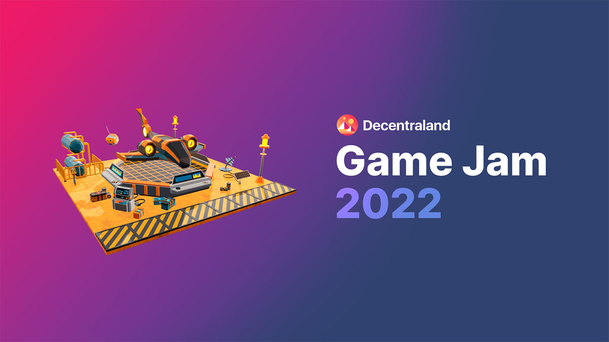

<br />
<p align="center">
<a >
    
</a>

<h3 align="center">Musical game developed for Decentraland Game Jam 2022<br /><br />[ by Inception Team ]</h3>

<p align="center">
      
</p>

## 🎵 About the game

Imagine how you bathe in the melodies of Decentraland.

Our scene is a Musical tower built from musical notes and scores.

Climbing onto the roof on the music platforms activates a new musical part with overcoming each floor.

After going through all the floors and climbing onto the top, the player enjoys playing the full music mix.

Depending on which route the player chooses, the final mix may sound different.

<p align="center">
    <br>
    <strong>Enjoy your mix and don't forget to grab the POAP</strong>
</p>

## 👀 Overview
<p align="center">
    <br>
    <strong>Game fast look</strong>
</p>
<br />
<p align="center">
    <br>
    <strong>Level builder using DCL Editor</strong>
</p>

## ✔️ Try it out
**Requirements**

node version: >=16.0.0

npm version: >=8.0.0

**Install the Decentraland CLI**

```bash
npm install -g decentraland
```

**Install the DCL-Edit**

Install awesome DCL Editor to be able to change the level as you want 

```bash
npm npm install -g dcl-edit
```

**Then install dependencies**
```bash
npm install
```
**Previewing the scene**

Run scene locally
```bash
dcl start
```

Start the editor running this command
```bash
dcl-edit
```

## 🙏 Acknowledgements
**Many thanks to DCL-Edit developers team!**

This game development was focused on using brand-new DCL-Edit product.

This solution helps to build and edit scene for Decentraland very fast.

Changes to a scene have immediate effect and can be tested right away and this is awesome!

With the help of DCL edit, the scene can be rebuilt very quickly, which makes it easily customizable and reusable.

**Wishes for future releases:**

- It would be great to add opportunity for multi-scenes development at DCL editor in future releases.
This improvement could help to develop several scenes for the game at the moment.

- For UI would be useful a change history view tab. 

- Turn on/off autosave of the editor scene.

## 📄 More

- Scene playground on Heroku: https://music-tower-dcl.herokuapp.com/
- Game walkthrough https://www.youtube.com/watch?v=KwyeCm8jc_o
- About Game Jam: https://decentraland.org/blog/announcements/the-2022-decentraland-game-jam-is-here/
- DCL-Edit: https://dcl-edit.com/
- POAP event: https://poap.gallery/event/49435


## 📑 License

This project is open source and available under the [MIT License](LICENSE).
